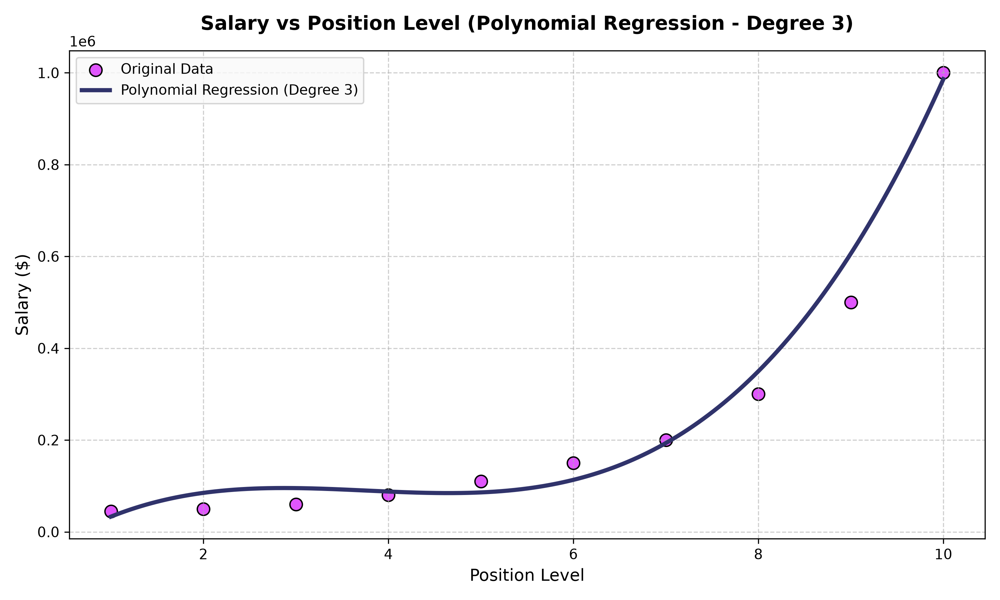

# 📈 Salary Prediction using Polynomial Regression


---

## 📌 Objective

The goal of this assignment is to develop a **Polynomial Regression model (Degree 3)** to predict employee salaries based on their position levels. This dataset represents a non-linear relationship where a simple linear regression model fails to capture the sudden exponential rise in salary at higher corporate levels. By modeling this with a cubic polynomial curve, we aim to build a robust predictor for wage hierarchies.

---

## 📊 Dataset

- **Source:** [Position Salaries Dataset on Kaggle](https://www.kaggle.com/datasets/akram24/position-salaries)
- **Records:** 10
- **Features:** 3 (`Position`, `Level`, `Salary`)

| Feature | Type | Description |
|---------|------|-------------|
| `Position` | Categorical | The job title (ignored during modeling as hierarchy is encoded in `Level`) |
| `Level` | Numerical | Job position hierarchy level (1 to 10) — **Input Feature (X)** |
| `Salary` | Numerical | Employee annual salary ($) — **Target Variable (y)** |

> [!WARNING]
> **Dataset Redistribution:** The dataset file is not uploaded to the public repository due to Kaggle redistribution rules. To run this project locally, please download the dataset from Kaggle and save it as `Position_Salaries.csv` in the project directory.

---

## 🛠️ Libraries Used

| Library | Purpose |
|---------|---------|
| `pandas` | Data loading, manipulation, and summary statistics |
| `numpy` | Numerical matrix transformations and grid generation |
| `matplotlib` | Creating high-quality scatter plots and plotting the regression curve |
| `scikit-learn` | Splitting datasets, feature expansion (PolynomialFeatures), and training LinearRegression |

---

## 🔄 Methodology

```
1. Load dataset using Pandas & analyze shape/columns
        ↓
2. Preprocess Data: Check missing values, separate feature (Level) & target (Salary)
        ↓
3. Train-Test Split: 80% Train, 20% Test (using random_state=42)
        ↓
4. Feature Expansion: Transform Level (1D) → Polynomial Features (Degree 3)
        ↓
5. Train Model: Fit Linear Regression on transformed polynomial features
        ↓
6. Predict Salaries on the testing subset (Levels 2 & 9)
        ↓
7. Evaluate Model: Calculate MAE, MSE, and R-squared metrics
        ↓
8. Visual Interpretation: Generate a smooth polynomial curve overlaying a scatter plot of original data
```

---

## 🤖 Model Explanation

Unlike a simple linear regression model that fits a straight line:

$$y = \beta_0 + \beta_1 X$$

A Polynomial Regression model of degree 3 expands the feature space to fit a cubic curve:

$$y = \beta_0 + \beta_1 X + \beta_2 X^2 + \beta_3 X^3$$

Where:
- $X$ is the Position Level.
- $y$ is the predicted Salary.
- $\beta_0$ is the intercept.
- $\beta_1, \beta_2, \beta_3$ are the learned model coefficients.

---

## 📏 Evaluation Metrics & Results

### Model Performance on Test Set (20%)

| Metric | Score / Value |
|--------|---------------|
| **Mean Absolute Error (MAE)** | \$70,635.25 |
| **Mean Squared Error (MSE)** | \$6,263,853,282.86 |
| **R-squared ($R^2$) Score** | 0.8763 |

### 📈 Regression Curve Visualization



---

## 📝 Observations & Conclusion

### Observations (Task 4)
1. **Accurate Non-Linear Modeling:** The cubic regression curve visually tracks the exponential salary progression closely. Simple linear regression would fail catastrophically by underpredicting salaries at senior levels (9 and 10) and overpredicting them in the mid-career range (4 to 6).
2. **Robust Variance Explanation:** The $R^2$ score of **0.8763** indicates that **87.63%** of the variance in test set salaries is explained by the degree-3 polynomial model. This is high considering the tiny dataset and large values.
3. **Evaluation Offsets:** The MAE of **\$70,635.25** is heavily skewed by the test set including Level 9 (\$500,000) and Level 2 (\$50,000). The cubic curve slightly underpredicts Level 9 because the salary jump from Level 8 to Level 9 is highly steep, which introduces a larger absolute error at high-level values.

### Conclusion (Task 5)
- **Key Findings:** The Polynomial Regression model (degree 3) successfully models the non-linear relationship of the dataset, explaining $87.63\%$ of the variance in salary on the test set.
- **Model Differences:** The fundamental difference between Simple Linear Regression and Polynomial Regression lies in their ability to model non-linear patterns. Linear regression assumes a straight-line relation ($y = \beta_0 + \beta_1 x$), leading to underfitting on exponential data. Polynomial regression introduces higher-degree terms ($y = \beta_0 + \beta_1 x + \beta_2 x^2 + \dots$), transforming the linear model to fit complex, curved relationships.
- **Advantage:** For this dataset, Polynomial Regression provides a significant advantage by capturing the exponential wage curve where salaries scale rapidly at executive levels (9 and 10), preventing the severe underprediction that occurs with a standard linear model.

---

## 📁 Repository Structure

```
Assignment-3/
│
├── Assignment-3.ipynb      # Complete Jupyter Notebook with code, plots, & analysis
├── README.md               # Project documentation (this file)
├── Position_Salaries.csv   # Dataset (local copy)
├── requirements.txt        # Python library dependencies
├── .gitignore              # Python git exclusions
│
└── images/                 # Saved visualization plots
    └── regression_curve.png
```

---

## 🚀 How to Run

1. **Clone the repository:**
   ```bash
   git clone https://github.com/<your-username>/Assignment-3.git
   cd Assignment-3
   ```
2. **Install dependencies:**
   ```bash
   pip install -r requirements.txt
   ```
3. **Execute Jupyter Notebook:**
   ```bash
   jupyter notebook Assignment-3.ipynb
   ```

---

*Built with ❤️ using Python and scikit-learn*
