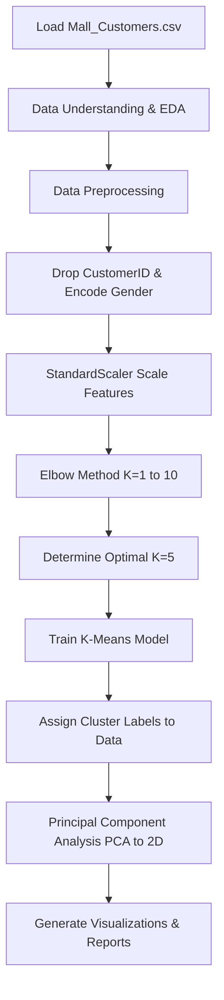
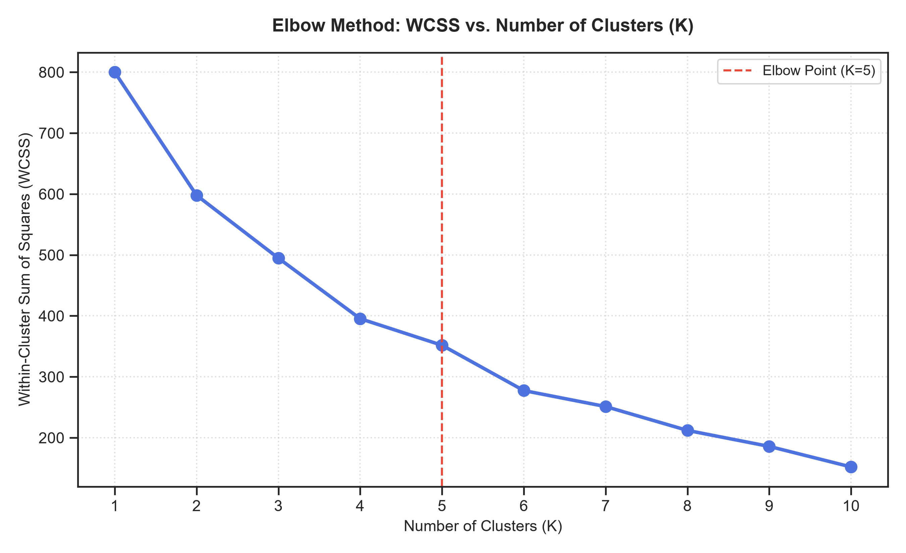
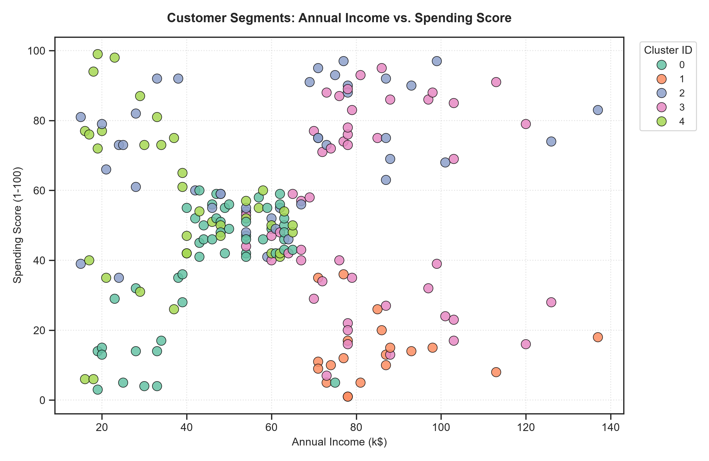
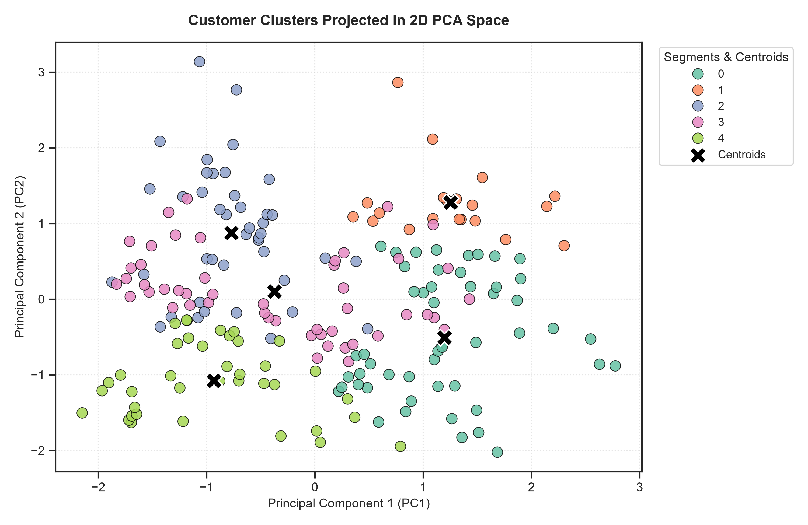

# Customer Segmentation using K-Means Clustering & Principal Component Analysis (PCA)

This project implements an end-to-end customer segmentation pipeline using **K-Means Clustering** and **Principal Component Analysis (PCA)** on the **Mall Customer Segmentation Dataset**. By grouping customers based on their demographics and purchasing behaviors, we identify distinct, actionable customer groups and project the high-dimensional data onto a 2D space for visualization.

---

## 🎯 Objective
The primary goal is to segment a mall's customer base to help the marketing team design highly targeted and effective marketing campaigns. By analyzing customer features such as Age, Annual Income, and Spending Score, we partition the customer base into distinct cohorts based on behavioral similarities.

---

## 📊 Dataset Reference
* **Dataset Name**: Mall Customer Segmentation Dataset
* **Source**: [Kaggle Customer Segmentation Tutorial](https://www.kaggle.com/datasets/vjchoudhary7/customer-segmentation-tutorial-in-python)
* **File Format**: `Mall_Customers.csv` (assumed to be in the working directory)

*Note: The dataset is not hosted in this repository due to Kaggle licensing terms; please download it directly from the link above.*

---

## 🛠️ Libraries Used
The project is built using standard scientific computing and machine learning libraries in Python:
* **Pandas**: Data loading, manipulation, and summary statistics.
* **NumPy**: Linear algebra and numerical operations.
* **Scikit-Learn**:
  * `StandardScaler`: Feature standardization.
  * `KMeans`: Unsupervised clustering.
  * `PCA`: Dimensionality reduction.
* **Matplotlib** & **Seaborn**: High-resolution, publication-quality data visualizations.

---

## ⚙️ Methodology & Pipeline

The machine learning pipeline is structured as follows:

### 1. Data Understanding (EDA)
* Load and inspect the dataset shape, columns, and head.
* Identify numerical features (`Age`, `Annual Income (k$)`, `Spending Score (1-100)`) and categorical features (`Gender`).
* Review basic metrics (min, max, mean, standard deviation) using `.describe()`.

### 2. Data Preprocessing
* Verify that there are no missing values in the dataset.
* Remove the identifiers column `CustomerID` since it does not contain clustering information.
* Encode `Gender` (categorical) into binary integer format: `Female -> 0`, `Male -> 1`.
* Standardize all features (`Gender`, `Age`, `Annual Income`, `Spending Score`) using `StandardScaler` to bring them onto a common scale (Mean = 0, Variance = 1). This prevents features with larger ranges (e.g., Annual Income) from dominating the Euclidean distance calculations.

### 3. Model Development
* **Optimal K Determination**: Compute the Within-Cluster Sum of Squares (WCSS) for $K = 1$ to $10$. Plotting WCSS vs. $K$ reveals a clear "elbow" point at $K = 5$, where adding more clusters yields diminishing returns in variance explained.
* **K-Means Clustering**: Fit K-Means with $K = 5$, using `k-means++` initialization to ensure stable convergence, and assign labels back to the dataframe.
* **Dimensionality Reduction**: Apply PCA to project the 4D standardized feature space into 2 principal components (`PC1` and `PC2`) for visual inspection and centroid analysis.

---

## 📈 Visualizations & Results

### 1. The Elbow Curve
The Elbow Method plot displays a significant drop in WCSS from $K=1$ to $K=5$, after which the curve levels off. This visually justifies selecting **$K=5$** as the optimal number of clusters.

### 2. Customer Clusters (Original Feature Space)
Plotting the customer clusters along **Annual Income** and **Spending Score** reveals the distinct customer behaviors:

### 3. PCA 2D Cluster Space
Since clustering is executed on the 4-dimensional preprocessed space (including Age and Gender), projecting the data onto the 2D PCA space (`PC1` vs. `PC2`) allows us to view the separation of the 5 clusters along the axes of maximum variance, including their centroids ($\mathbf{X}$).

* **PC1 Variance Explained**: 33.69%
* **PC2 Variance Explained**: 26.23%
* **Total Cumulative Variance Explained**: **59.92%**

---

## 📋 Customer Segment Profiles

Below is the summary statistics profile for each of the 5 identified customer segments:

| Cluster ID | Segment Name | Avg Age | Avg Income (k$) | Avg Spending (1-100) | Gender Composition | Behavioral Characteristics |
| :---: | :--- | :---: | :---: | :---: | :---: | :--- |
| **0** | **Older Frugal Shoppers** | ~56.5 | ~$46.1K | ~39.3 | Mixed (~51% Male) | Older, average income, moderate-to-low spending. Highly conservative and practical buyers. |
| **1** | **Careful High-Earners** | ~39.5 | ~$85.2K | ~14.1 | 100% Male | High income, low spending. Selective buyers with strong purchasing power but low impulsivity. |
| **2** | **Spendthrift Young Males** | ~28.7 | ~$60.9K | ~70.2 | 100% Male | Young, moderate-to-high income, high spending. Trend-driven, active consumers, responsive to marketing. |
| **3** | **Premium Target Females** | ~37.9 | ~$82.1K | ~54.4 | 100% Female | High income, moderate-to-high spending. Premium demographic. High value, regular luxury purchasers. |
| **4** | **Sensible Young Females** | ~27.3 | ~$38.8K | ~56.2 | 100% Female | Young, low-to-moderate income, moderate spending. Active shoppers relative to earnings. |

---

## 💡 Business Applications & Marketing Strategies

* **Luxury & Premium Campaigns (Cluster 3)**: Target these high-earning, high-spending females with personalized email campaigns, exclusive product pre-launches, and luxury loyalty rewards.
* **Conversion Strategies (Cluster 1)**: Reach out to high-earning males with high-quality value propositions, memberships, or product utility updates to convert their high income into sales.
* **Discount & Flash Sales (Cluster 4)**: Target young females with discounts, buy-one-get-one-free (BOGO) offers, and social-media-driven influencer campaigns to match their high-spending mindset.
* **Customer Retention (Cluster 0 & 2)**: Re-engage older shoppers (Cluster 0) with traditional marketing and health/utility-oriented benefits. Keep young spendthrift males (Cluster 2) engaged with gamified apps and tech trends.

---

## 🔑 Key Insights & Machine Learning Trade-offs

### K-Means Clustering Limitations
* **Sensitivity to Feature Scaling**: Because K-Means relies strictly on Euclidean distance, binary encoded variables like `Gender` will dictate the clusters if scaled. Here, standardizing Gender ($0$ and $1$) causes a strict separation where Clusters 1 and 2 are 100% Male, and Clusters 3 and 4 are 100% Female.
* **Spherical Assumption**: K-Means assumes spherical clusters of equal size, which can miss elongated, complex patterns in real-world distribution data.

### PCA Advantages
* **Dimensionality Reduction**: Successfully projected the 4D data into 2D space, capturing ~60% of the variance and allowing clear visualization of the multi-dimensional groupings.
* **Noise Reduction**: Discards components that explain minimal variance, allowing the models and analysts to focus on major axes of customer differences rather than random fluctuations.
